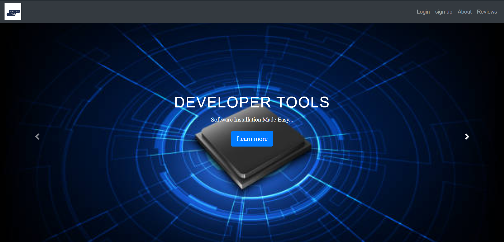
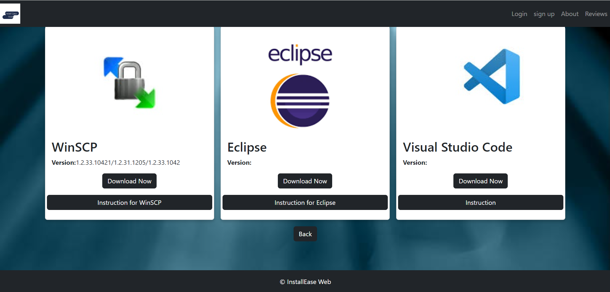

**Install_Ease_Web**

Here,We designed a website using HTML,CSS and Bootstrap.

Our platform provides clear paths and step-by-step instructions to make software installation straightforward and hassle-free.

We included several Software categories named  runtimes, online storage solutions, web browsers, developer tools and media.

Webpage view:

Steps to Run our code:

1. Clone our repository
2. Navigate to the project directory
3. View the code in any Text Editor
4. Open index.html in Web Browser

